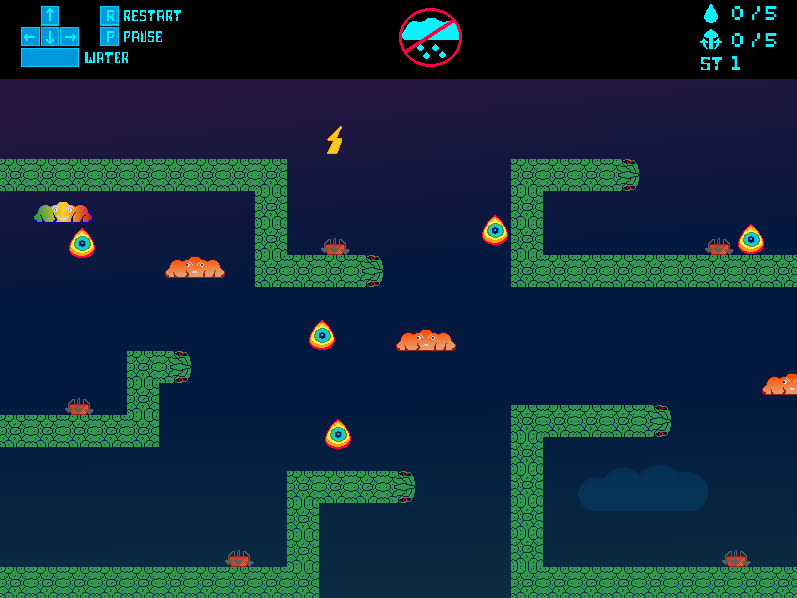

# Rebirth

This is a game I created in a short time specifically for the Kajam game jam to support the [kaplayjs](https://kaplayjs.com/) community. The development process was intense and fast-paced, so the code might be a bit rough edges.

### See screenshot

### How to Run Locally

Clone the repository, `run npm install`, then start the server with `npm run dev`. Open the local URL in your browser.

You can [play](https://blackbird-dev.itch.io/rebirth-jam)
